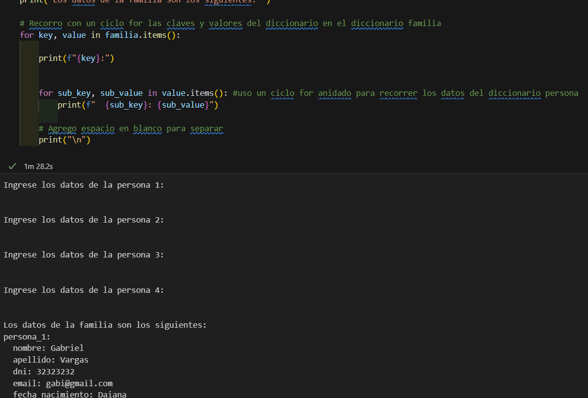

# Ejercicios_clases_Programacion_ispc

###  BEJERCICIO 1:
* Un estudiante está cursando 5 materias, tiene la nota de cada materia y quiere saber cuál es su promedio

**Inicio**
Materia 1 = ingreso la nota con datos  int // variable

Materia 2 = ingreso la nota con datos  int// variable

Materia 3 = ingreso la nota con datos  int // variable

Materia 4 = ingreso la nota con datos  int // variable

Materia 5 = ingreso la nota con datos  int// variable 

Total de materias = 5 dato int // Constante definida por el problema

Calculo:  (Materia 1+Materia 2 + Materia 3 +Materia 4 + Materia 5)/Total de materias

**Fin**

Algoritmo Promedio_5_materias

	Definir nota_1, nota_2, nota_3, nota_4, nota_5, materias Como Entero
 
	Escribir 'Ingrese nota 1'
 
	Leer nota_1
 
	Escribir 'Ingrese nota 2'
 
	Leer nota_2
 
	Escribir 'Ingrese nota 3'
 
	Leer nota_3
 
	Escribir 'Ingrese nota 4'
 
	Leer nota_4
 
	Escribir 'Ingrese nota 5'
 
	Leer nota_5
 
	materias <- 5
 
	Promedio <- ((nota_1+nota_2+nota_3+nota_4+nota_5)/materias)
 
	Escribir 'El promedio es ', Promedio
 
Fin del Algoritmo

# Ejercicio 2
 
### 1)- **Analisis del problema**:

Un pintor de casas debe hacer un presupuesto para un cliente. Lo que cobra se calcula de acuerdo a los metros cuadrados que debe pintar. El cliente le indica que necesita conocer el costo de mano de obra para pintar una pared rectangular de un galpón. El pintor cobra un monto fijo por cada metro cuadrado.

**Datos a ingresar:** 
•	Alto y ancho de a pared
•	Precio que cobra por metro cuadrado

**Proceso:** 
Debo calcular la superficie de la pared y multiplicarlo por el precio de la mano de obra por metro cuadrado

**Datos de salida:** el precio de la mano de obra.

### 2) – PSeudocódigo 

1)	**Declarar variables:**
Alto = valor int

Ancho = valor int

Precio_metro_cuadrado = valor int (para redondear usamos valores enteros)

3)	**Ingreso Alto**
4)	**Ingreso Ancho**
5)	**Ingreso Precio_metro_cuadrado**
6)	**Calculo:**  Alto *Ancho * Precio_metro_cuadrado
7)	**Mostrar Calculo**

### 3)	Diagrama de flujo

# Ejercicio 3

**Analisis:**
Un hincha de fútbol desea conocer la cantidad de puntos que su equipo lleva acumulados en el campeonato, para ello recibe cada semana la información de la cantidad total de partidos, desde el inicio del campeonato, que el equipo ha perdido, ha empatado y ha ganado. Por cada partido empatado recibe un punto, por cada partido ganado tres puntos y por los perdidos cero puntos.
Datos de entrada:

•	Partidos ganados, empatados y perdidos // datos enteros variables
•	Nombre del equipo de futbol // dato string
•	Constantes:
 * puntos de partidos ganados = 3 // dato entero
   
* puntos partidos empatados = 1 // dato entero
  
* puntos partidos perdidos = 0 // dato entero
  
**Proceso:** 
Debo elegir un equipo y sumar el total de partidos ganados multiplicado por la cantidad de puntos correspondientes y del mismo modo sumarle los partidos empatados y perdidos.

**Salida:**
El total de puntos por equipo elegido. 

### Pseudocódigo
1)	Declarar variables:
* Pganados = int 
* Pempatados = int
* Pperdidos = int

2)	Declaro constantes
* Gana = 3
* Empata = 1
* Pierde = 0

3)	Realizo calculo de puntos
* Resultado = (Pganados*gana + Pempatados*empata + Pperdidos*pierde)
  
4)	Muestro resultados

# Desafio Casa de Cambio

**Analisis:**
se necesita un programa que convierta un monto en pesos argentinos a dólares. El tipo de cambio utilizado es $890 pesos argentinos por 1 dólar.

**Datos de entrada:**

Variables:

•	Monto en pesos = dato tipo float

* Constantes: valor del dólar en pesos = dato tipo float
  
**Proceso:** 
* Ingresar monto en pesos 
* Calcular cambio: Monto en pesos / valor dólar
* Presentar resultados
**Datos de salida:**
   monto equivalente en dólares, dato float

**Pseudocodigo**
1)	Declarar variables, monto en pesos
2)	Declara constantes
3)Ingresar monto en pesos
4)Calcular cambio

Diagrama de Flujo

**Código en Python**

#Declaro el valor del dolar en pesos argentinos

valor_dolar = 890

#Solicito que se ingrese el valor en pesos del que deseo conocer su cambio

pesos = float(input("Ingrese el monto en pesos argentinos, usando números: "))

#Calculo el equivalente en dólares

Cambio = pesos/valor_dolar

#Mostrar el cambio equivalente

print("El monto equivalente en dolares es", Cambio)

# Estructuras Iterativas.
### Ejercicio 1
**Analisis:**
Mostrar los números desde el 0 al número solicitado al usuario (input)

**Datos de entrada:**

Numero ingresado = dato entero variable

**Proceso:**

Generar secuencia de números desde el cero hasta el ingresado 

**Salida:**

Muestra secuencia de números

**Pseudocodigo:**

* 1)Ingresar numero
* 2)Generar secuencia desde el cero
* 3)Mostrar números
  
**Programa en Python**
  
#Solicitar al usuario un número

numeroIngresado = int(input("Ingrese un número: ")) #Convertimos el dato ingresado a entero

#Utilizar un bucle for para mostrar los números desde 0 hasta el número ingresado

for i in range(numeroIngresado + 1):

    print(i) #Mostramos la secuencia

## Ejercicio 2:
**Analisis:** 

Queremos mostrar sólo los números pares desde el cero hasta el número que se ingresa

**Datos de entrada:**

Numero ingresado = dato entero variable

**Proceso:**

Generar secuencia de números pares desde el cero hasta el ingresado 

**Salida:**

se muestran solo los números pares hasta el ingresado.

**Pseudocodigo:**

* 1)Ingresar numero
* 2)Generar secuencia de pares desde el cero
* 3)Mostrar números

**Programa en python**

#Solicitar al usuario un número

numero_ingresado2 = int(input("Ingrese un número entero: "))

#Utilizar un bucle for para mostrar los números pares desde 0 hasta el número ingresado

for i in range(0, numero_ingresado2 + 1):

    if i % 2 == 0: #Si la division es cero se agrega a la muestra
    
        print(i)

# Ejercicio 3

**Análisis:** 
Solicitar que se ingrese nombres de usuario hasta que se ingresa la palabra fin.

**Datos de entrada;**
Variables tipo string 

Constante = string con el valor ¨fin¨

**Salida:**
Nombres ingresados

**Pseudocódigo**

* 1)Determinamos la constante fin
* 2)Se solicita que se ingresen nombres
* 3)Se evaluan los nombres y se muestran hasta que se obtiene la palabra fin
* 4)Se muestran los nombres o se finaliza el programa

**Programa en Python**

#Determino la constante
clave = "fin"

#Solicitamos nombres de personas hasta que se ingrese "fin"

while True:

    nombre_ingresado = input("Ingrese el nombre de una persona (o 'fin' para terminar): ")
    
    if nombre_ingresado.lower() == clave:
    
        break
	
    print(nombre_ingresado)

# EJERCICIOS DE ESTRUCTURA DE DATOS
Desarrollar en Python las siguientes consignas utilizando los recursos ya vistos (variables, input, print, if, if - else, while, for) que consideren adecuados para cada uno de estos casos:

* 1.	Pedir al usuario que ingrese 10 nombres de personas (input en un ciclo) no repetidas, guardarlos en una lista y mostrarlos. 
* 2.	Eliminar la tercer y la última persona de la lista del ejercicio 1, luego ordenar la lista y mostrarlo
* 3.	Guardar en un diccionario los datos de una persona: nombre, apellido, dni, email, fecha de nacimiento.
* 4.	En un nuevo diccionario llamado familia guardar 4 personas, cada una de ellas con los mismos 5 datos (nombre, apellido, dni, email, fecha de nacimiento)
* 5.	Guardar en una tupla los primeros n números pares. El valor de n que lo ingrese el usuario (input). Luego mostrar los datos de la tupla.
     
 Nota: para saber si el número i es par hacer i % 2 == 0

# Ejercicio 1

 **Pedir al usuario que ingrese 10 nombres de personas (input en un ciclo) no repetidas, guardarlos en una lista y mostrarlos**

 **Programa en python**

#Utilizo una lista vacia llamada mis_nombres para ir agregandolos dentro

mis_nombres = []

#Utilizo el bucle while (mientras) para ingresar nombres siembre que la cantidad ingresada sea menor a 10

while len(mis_nombres) < 10: # con len cuento la cantidad de nombres 
    
    #Empiezo a ingresar los nombres con input y uso strip para eliminar espacios en blanco alrededor de la palabra
    
    tu_nombre = input("Por favor ingrese un nombre: ").strip()
    
    #Verifico que no haya repetidos, si cumple con la condicion no se muestra
    
    if tu_nombre in mis_nombres:
        
        print("El nombre ingreasdo está repetido, ingresa otro ")
        
    else:
    
        mis_nombres.append(tu_nombre) #De otro modo el nombre se agrega a la lista usando .append
        
#Mostramos la lista

print("Los nombres unicos ingresados son: ")

#Recorro con un bucle for los nombres de la lista y los voy mostrando

for tu_nombre in mis_nombres:
    print(tu_nombre)

# Ejercicio 2

**Eliminar la tercer y la última persona de la lista del ejercicio 1, luego ordenar la lista y mostrarlo**

**Programa en python**

#Eliminamos la tercer persona la cual es la 2 ya que se cuenta desde cero

mis_nombres.pop(2) #utilizo pop para eliminar en la ubicacion 2

#Elimino con pop el ultimo elemento

mis_nombres.pop()

#Ordeno la lista alfabeticamente con sort
mis_nombres.sort()

#Mostramos la lista ordenada
print("La siguiete lista es la ordenada luego de eliminar el ultimo nombre y el segundo: ")

#Recorro los nombres en la lista mis_nombres que quedaron y los presento

for tu_nombre in mis_nombres:

    print(tu_nombre)

# Ejercicio 3

**Guardar en un diccionario los datos de una persona: nombre, apellido, dni, email, fecha de nacimiento.**

#Pido los datos de una persona y elimino los espacios en blanco con strip

nombre = input("Ingresa el nombre: ").strip()

apellido = input("Ingresa el apellido: ").strip()

dni = input("Ingresa el DNI: ").strip()

email = input("Ingresa el email: ").strip()

fecha_nacimiento = input("Ingresa la fecha de nacimiento respetando la forma (dia/mes/año): ").strip()

#Guardamos los datos en un diccionario llamado persona

persona = {
    "nombre": nombre,
    
    "apellido": apellido,
    
    "dni": dni,
    
    "email": email,
    
    "fecha_nacimiento": fecha_nacimiento
}

#Mostramos el diccionario iterandon la clave y el valor con .items() y usando el ciclo for

print("Datos de la persona:")

for key, value in persona.items():

    print(f"{key}: {value}")
    

# Ejercicio 4

**En un nuevo diccionario llamado familia guardar 4 personas, cada una de ellas con los mismos 5 datos (nombre, apellido, dni, email, fecha de nacimiento)**

#Inicializo un diccinario vacio

familia = {}

#Itero sobre cada numero del rango que va del 1 al 4 usando el ciclo for 

for i in range(1, 5): #uso i como un contador para no repetir mas de 4 veces la carga de datos

    print(f"Ingrese los datos de la persona {i}:")
    
    nombre = input("Ingrese el nombre: ").strip()
    
    apellido = input("Ingrese el apellido: ").strip()
    
    dni = input("Ingrese el DNI: ").strip()
    
    email = input("Ingrese el email: ").strip()
    
    fecha_nacimiento = input("Ingrese la fecha de nacimiento (DD/MM/AAAA): ").strip()
    
    persona = {
    
        "nombre": nombre,
	
        "apellido": apellido,
	
        "dni": dni,
	
        "email": email,
	
        "fecha_nacimiento": fecha_nacimiento
    }
    
    # Agrego la persona al diccionario familia que estaba vacio
    
    familia[f"persona_{i}"] = persona

    # Agrego una línea en blanco para separar los diccionarios
    
    print("\n")

#Muestro el diccionario familia

print("Los datos de la familia son los siguientes: ")

#Recorro con un ciclo for las claves y valores del diccionario en el diccionario familia

for key, value in familia.items():
    
    print(f"{key}:")
    
    
    for sub_key, sub_value in value.items(): #uso un ciclo for anidado para recorrer los datos del diccionario persona
    
        print(f"  {sub_key}: {sub_value}")
        
    # Agrego espacio en blanco para separar
    
    print("\n")

# Ejercicio 5

**Guardar en una tupla los primeros n números pares. El valor de n que lo ingrese el usuario (input). Luego mostrar los datos de la tupla.**

#Pido ingresar el valor de n, es decir la cantidad de numeros pares que queremos ver

n = int(input("Ingresa el valor de n, la cantidad de numeros pares a ver: "))

#Genero los primeros n números pares multiplicando por 2 cada numero i

#creando un rango que va desde 0 hasta n-1, y convirtiendo en tupla

numeros_pares = tuple(i * 2 for i in range(n)) 

#Muestro los números pares

print("Los primeros", n, "números pares son:")

#Recorro los numeros pares y los imprimo

for numero in numeros_pares:

    print(numero)

